# Setting up your repository

You can create your own workshops that can be imported in the plugin.
When importing a github repo the plugin will look for a directory structure describing the tutorials.

Take a look at this example: 
<a href="https://github.com/ethereum/remix-workshops" target="_blank">Remix workshops repository</a>

## Basic concepts

**Each tutorial is a group of 'steps'.**

For example the tutorial called "Remix Basics" contains steps to teach you:
* The UI
* How to compile files
* How to deploy
* ...

A step is one task the user needs to do, or one thing they need to learn. For example how to deploy contracts.
But it can be anything you like.

A step contains a file describing what the student needs to do or learn. 

It can also contain several **code files**:

* **solidity, js or vyper files**. These will be loaded automatically when the step opens. Your step will describe the file or tell users what to do with it, for example, add something and compile.
* **answer files**. These are files containing the correct answer of the step.
* **test files**. Solidity Unit Testing files.

More on [File types](#file-types)


**A list of tutorials.**

You can have more than one tutorial in your repo, it's like a list of tutorials. And each tutorial has its own directory and its own configuration.

**Levels**

To make it easy to categorize your tutorials we have 3 levels, beginner, intermediate and advanced. You can set this in the config of your tutorial.

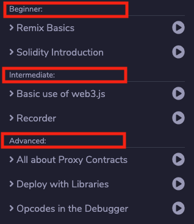

## Root file stucture

It is important you adhere to the directory structure for the system to work, loading any repo with sol files won't work.

So for example

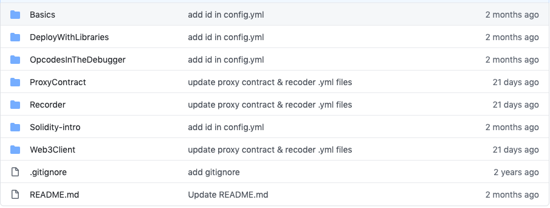

The readme.md in the root directory is not used by the plugin.

Each directory in the root is a **tutorial or workshop**.

For example *Basics* is a tutorial that contains steps teaching the basics of the Remix IDE.


## Naming your tutorials

The name of the tutorial that is displayed in the LearnEth plugin will be either the 
* name of this directory, for example 'Basics'
OR
* a name provided in a yml file.

This config.yml file lives in each directory and is *required* by the system.


config.yml:
``` 
---
name: Remix Basics
```

This name will appear everywhere in the UI. 

So for example in the main list of tutorials:

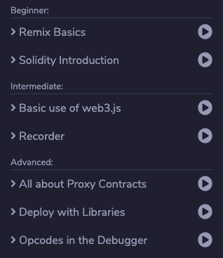

## Sorting tutorials

The tutorials are grouped by level, ie Beginner, and then sorted alphabetically by name.

## Description of your tutorial

The description is shown in the overview in the list of tutorials:

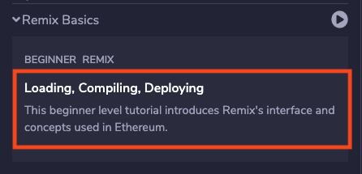

This is the content of the readme.md in the tutorial directory. It's in markdown.

## Tags & levels

As mentioned before a tutorial can have a level, but it doesn't have to have one.
It can also have tags. In this example the tag is REMIX, the level is BEGINNER.

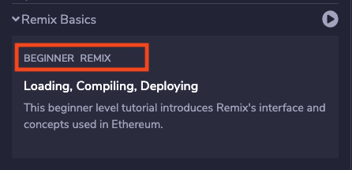

You can set the level and tags in the config.yml file

```
level: 1
tags: 
  - Remix
  - tag2
  - tag3
```

Level 1 is beginner. Level 2 is intermediate. Level 3 is Advanced.

## Name of a step

The name of a step is just the name of directory it resides in, but without any _.

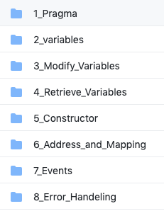

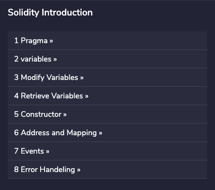

## Sorting steps

Steps are sorted alphabetically according to the name of the directory. So it's best to precede each step name by a number.
## Step description

When you open a step, you see a text describing what to do or learn.
This text is provided by the markdown file in the directory of each step.

In this example the file would be here: Solidity-intro/1_Pragma/pragma.md

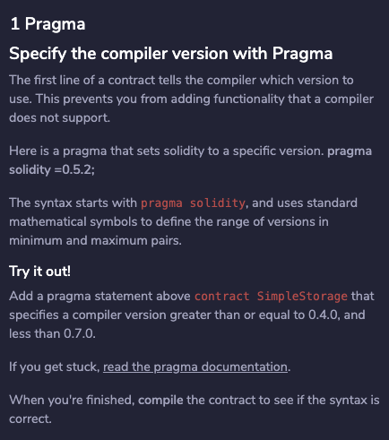
## File Types & loading files

Each step can contain one file of each type.
So this means:
- a markdown file describing the step
- a solidity file (.sol)
- a js file (.js)
- a vyper file (.vy)
- a test file The naming convention for these is name_test.sol
- an answer file. The naming convention for these is name_answer.sol

When a step loads the code files are loaded automatically into the Remix IDE. But not the answer file.
The test file is only used by the Unit Testing system and not loaded in the IDE.

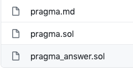

## Answer files

Answer files are just files that display an answer. This can be anything. 

If the filename contains _answer it will be shown in the interface and users can click on 'SHOW ANSWER'.


## Test files

These are Solidity Unit Testing files.

They are run through the Unit testing system when a user clicks on: 'CHECK ANSWER'.

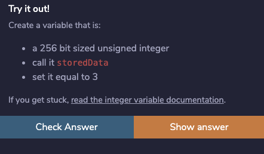

If the test fails the UI displays an error.

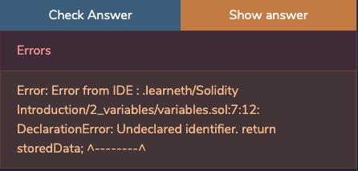

If the test succeeds the user can proceed to the next step:


**The user can always skip a step by picking a step in the steps overview or using the navigation.**

