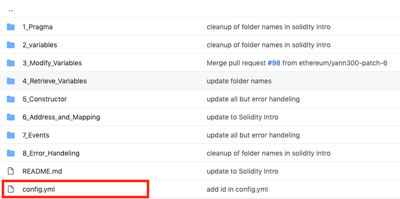

# Setting up your repository

You can create your own workshops that can be imported in the plugin.
When importing a github repo the plugin will look for a directory structure describing the workshops.
For example: https://github.com/ethereum/remix-workshops

## Basic concepts

**Each tutorial is a group of 'steps'.**

For example the tutorial called "Remix Basics" contains steps to teach you
* The UI
* How to compile files
* How to deploy

And so on.

**What is a step?**

A step contains a file describing what the student needs to do or learn. 

It can also contain several **code files**:

* **solidity, js or vyper files**. These will be loaded automatically when the step opens. Your step will describe the file or tell users what to do with it, for example, add something and compile.
* **answer files**. These are files containing the correct answer of the step. 

More on these files: [File types](#file-types)


**Your repo hosts several tutorials.**


## Root file stucture

It is important you adhere to the directory structure for the system to work, loading any repo with sol files won't work.

So for example


Each directory in the root is a **group of tutorials/workshops**.

For example *Basics* contains tutorials teaching the basics of the Remix IDE.

## Naming your group of tutorials

The name of the group that is displayed in the LearnEth plugin will be the name of this director,
for example Basics OR a name provided in a yml file.

This config.yml file lives in each directory and is *required* by the system.



config.yml:
``` 
---
name: Remix Basics
```

This name will appear everywhere in the UI. 

So for example in the main list of tutorials:


## File types

